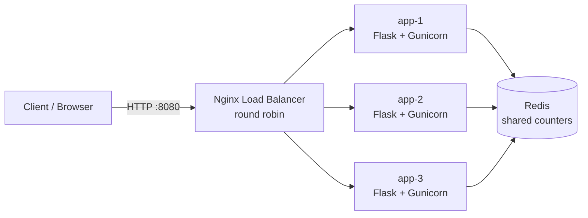

# Load-Balanced Multi-Instance App (Nginx + Docker + Redis)


Cloud Computing graded assessment: **Option 3, Load-balanced multi-instance app**.

The same Flask app runs in **3 separate containers** behind an **Nginx load balancer**.
A web dashboard sends requests and shows, live, which instance served each one.
All instances write to a shared **Redis**, which demonstrates distributed state.

## Architecture



```
                         +--> app-1 --+
Client --> Nginx (LB) ---+--> app-2 --+--> Redis
 :8080     round robin   +--> app-3 --+
```

| Component | Role |
|-----------|------|
| Nginx | Reverse proxy / load balancer, round-robin, passive health checks (`max_fails`) |
| app-1..3 | Identical Flask containers, each with its own `INSTANCE_NAME` |
| Redis | Shared store so all instances see the same counters (stateless app tier) |
| Docker Compose | Starts the whole 5-container stack with one command |
| GitHub Actions | Runs tests, then a Docker smoke test, then optional EC2 deploy |

### Concepts demonstrated
- **Client-server paradigm**: browser (client) talks to the server tier through one entry point.
- **Horizontal scaling**: add more identical instances behind the LB instead of a bigger machine.
- **Load balancing**: requests are spread across instances (round robin).
- **Fault tolerance**: stop a container and traffic keeps flowing to the rest.
- **Stateless services + shared state**: state lives in Redis, not inside app containers.
- **Containers**: everything is Dockerised and reproducible.

## Project structure
```
app/                Flask app (+ dashboard template)
tests/              pytest test cases (7)
nginx/nginx.conf    load balancer config
Dockerfile          app image
docker-compose.yml  full stack
.github/workflows/  CI/CD pipeline
scripts/pre-push    local git hook that blocks push on failing tests
```

## How to run (local)
Requires Docker + Docker Compose.

```bash
git clone https://github.com/prithvirajkattimani/cc-load-balancer.git
cd cc-load-balancer
docker compose up --build
```
Open **http://localhost:8080** and click **Send 20** / **Auto**. Bars show requests spread across `app-1`, `app-2`, `app-3`.

Or from the terminal:
```bash
for i in $(seq 1 9); do curl -s localhost:8080/api/whoami; echo; done
```

### Show fault tolerance
```bash
docker compose stop app2      # kill one instance
# keep sending requests: they are now served by app-1 and app-3 only
docker compose start app2     # bring it back
```

### Show horizontal scaling
Add `app4` in `docker-compose.yml` (copy `app3`, change `INSTANCE_NAME`) and add `server app4:5000;` in `nginx/nginx.conf`, then `docker compose up -d --build`.

## API
| Endpoint | Description |
|----------|-------------|
| `GET /` | Dashboard |
| `GET /health` | Health check |
| `GET /api/whoami` | Which instance served this request + counters |
| `GET /api/stats` | Per-instance hit counts from Redis |
| `POST /api/reset` | Reset counters |

## Tests
```bash
pip install -r requirements-dev.txt
pytest -v
```
7 tests: health check, instance info, counter increment, two instances sharing one store, reset, dashboard page, JSON 404.

## CI/CD (GitHub Actions)
Workflow: `.github/workflows/ci.yml`

1. **test**: installs deps and runs `pytest`.
2. **docker-smoke** (needs `test`): builds the full stack, sends 12 requests and fails unless at least 2 different instances answered.
3. **deploy** (needs `docker-smoke`): SSHes into EC2 and redeploys. Disabled unless repo variable `ENABLE_EC2_DEPLOY=true`.

### Blocking pushes/merges when tests fail
1. GitHub repo → **Settings → Branches → Add branch ruleset / protection rule** for `main`.
2. Enable **Require a pull request before merging** and **Require status checks to pass**.
3. Select the checks **Unit tests** and **Docker + load balancing smoke test**.
4. Enable **Do not allow bypassing the above settings** (include administrators).

Now code with failing tests cannot be merged into `main`.
Local safety net: `cp scripts/pre-push .git/hooks/pre-push && chmod +x .git/hooks/pre-push`

## Deploy on AWS EC2 (optional)
1. Launch an EC2 instance (Ubuntu 22.04/24.04, t2.micro/t3.micro). Security group: allow **22** (SSH) and **8080** (or map to 80).
2. SSH in and install Docker:
   ```bash
   sudo apt update && sudo apt install -y docker.io docker-compose-v2 git
   sudo usermod -aG docker $USER && newgrp docker
   ```
3. Clone and start:
   ```bash
   git clone https://github.com/prithvirajkattimani/cc-load-balancer.git
   cd cc-load-balancer && docker compose up -d --build
   ```
4. Open `http://<EC2-PUBLIC-IP>:8080`.
5. For auto-deploy from GitHub Actions: add repo **Secrets** `EC2_HOST`, `EC2_USER` (e.g. `ubuntu`), `EC2_SSH_KEY` (contents of your .pem), and repo **Variable** `ENABLE_EC2_DEPLOY=true`.

> Remember to stop/terminate the EC2 instance after the demo to avoid charges.

## Tech stack
Python 3.12, Flask, Gunicorn, Redis, Nginx, Docker, Docker Compose, GitHub Actions, pytest.
